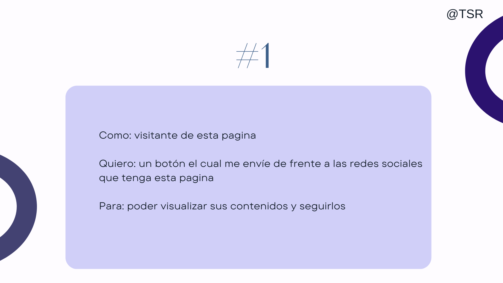

# Magical-Beauty
Tienda online de maquillaje, cuidados de belleza y mucho mas
## Problematica:

### Las personas en general, no tienen suficiente tiempo para salir hacer compras de maquillajes, por tal motivo se han descuidado al arreglarse, y han olvidado como usar los productos de maquillajes.

## Objetivos:

### El objetivo con nuestra página es que las personas se sientan más cómodas a la hora de comprar nuestros productos originales, sin un gran precio y que puedan tener la libertad de ver tutoriales y/o tips para de la misma forma podamos guiarles para una mejor atención. La página contiene tips de todo tipo, es minimalista e intuitivo para la gente, pero por cualquier duda pueden ir al apartado de "ayuda" y será un placer atender todas sus dudas

## Historia de usuarios

## Funcionalidad

### Contamos con una página web MAGICAL BEAUTY donde tenemos variedad de productos para el cuidado y belleza. Dando un clic a la siguiente página donde puedes comprar por categoría en tienda virtual, variedad de esmaltes, bases, sombras y más en promociones, ofertas al público y nuevos productos. Ofrecemos:

* Paletas de colores
* skincare
* Bronchas
* Labiales

### Cada producto tiene su precio, usa el botón morado donde dice "añadir al carrito" para tus  respectivas compras. También te damos la opción de ser parte de nuestro miembro para que tengas acceso a las promociones y ofertas del día, mediante un correo llegará las nuevas promociones con sus respectivos precios en tendencia. Cada mes sé irá actualizando nuestros productos en venta.

## Prototipo de nuestra tienda

## Metodologias aplicadas al proyecto
### Link Medium:
* https://medium.com/@toprosies/magical-beauty-d8ddb0556c50

### LEARN STARTUP
* 

###  MODELO CANVAS
* 

### DESING THINKING [Link del documento]
* https://www.canva.com/design/DAFefiDqQQ8/4xCJN0gWaI0FvOr_MAaLpw/edit?utm_content=DAFefiDqQQ8&utm_campaign=designshare&utm_medium=link2&utm_source=sharebutton

  
## Video explicativo de la funcionalidad de nuestra pagina:
* https://drive.google.com/file/d/1-CSmXc7UYPqrqAh03SZgFrXWeRyTgq3q/view?usp=share_link
  ## Enlace a la página:
  ### https://joskim28.github.io/Magical-Beauty/
